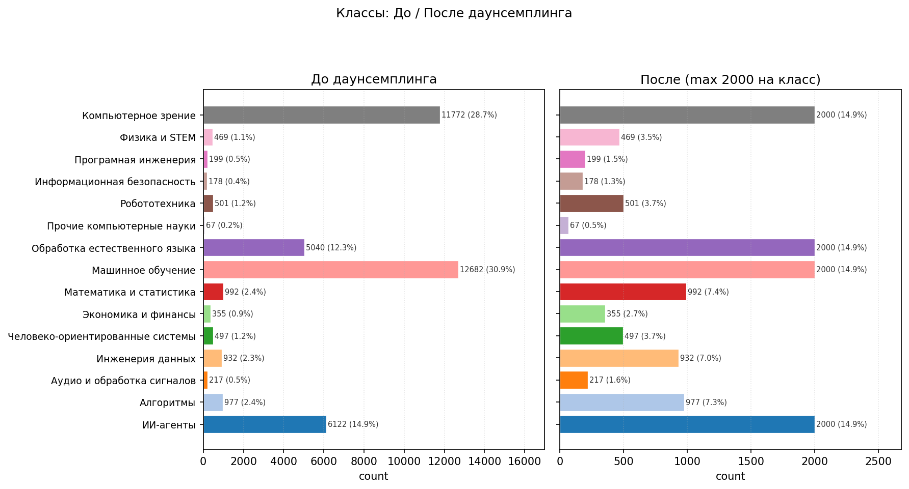

# ML2HW4

## 1. Данные

Датасет для обучения формируется скриптом `build_dataset.py`. Метки из исходных записей извлекаются скриптом `arxiv_taxonomy.py` в соответствии с сопоставления кодов arXiv итоговым категориям. Получается 15 классов.

Распределение объектов по классам несбалансировано, при подготовке данных используется даунсемплинг. Ниже — распределение по меткам до и после даунсемплинга.



## 2. Обучение

Код обучения — `train.py`. Эксперименты выполнялись с моделями `bert-base-uncased` и `allenai/scibert_scivocab_uncased`. Значения метрик качества ожидаются к дополнению.

---
## 3. Воспроизведение

```bash
git clone https://github.com/VladKozlovskiy/ML2HW4
cd ML2HW4
uv sync
uv run python build_dataset.py
uv sync --extra train
uv run python train.py --model-path bert-base-uncased --epochs 1 --output-dir arxiv_model
uv run python train.py --model-path allenai/scibert_scivocab_uncased --epochs 3 --output-dir arxiv_model_scibert
```
## 4. Результаты

Метрики на валидации (после обучения в конфигурации из §3):

| Модель | Accuracy | F1 (weighted) |
|--------|----------|---------------|
| `bert-base-uncased` | 0.7587 | 0.726 |
| `allenai/scibert_scivocab_uncased` | 0.7693 | 0.759 |

Лучшая по обеим метрикам модель — `allenai/scibert_scivocab_uncased` (SciBERT).